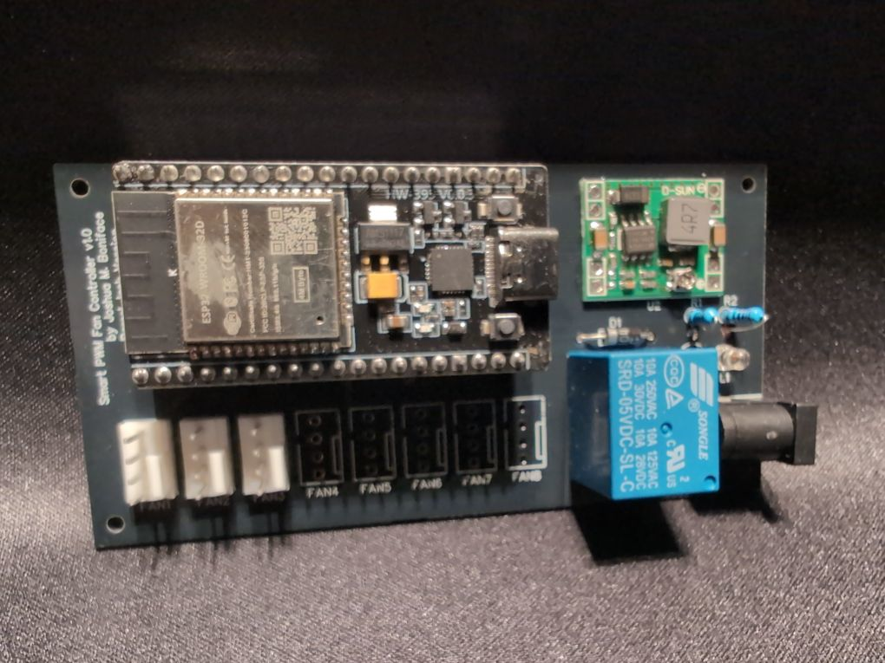

# Smart PWM Fan Controller v1.x

The Smart PWM Fan Controller is a 4-pin 12V PWM PC fan controller (as the name implies) based on the ESP32 HW-395 form-factor and running ESPHome, and powered by a 12VDC barrel jack or 12V EPS (CPU) connector (ensure you pick the right board design).

It can connect up to 8 fans directly, with the following functionality:

 * Bank on/off via relay.
 * Bank PWM control (0-100%) via ESP32 GPIO.
 * Individual fan RPM monitoring (2PPM) via ESP32 PCNT.
 * Bank fault detection via settable fan count and RPM detection (an expected-present fan with 0 RPM while on is a fault).

The PCB design details and assembly instructions can be found [in /board](board/) and on [OSHWLab](https://oshwlab.com/joshuaboniface/microenv-2-0).

For full details, [please see my blog post on the project](https://www.boniface.me/posts/smart-pwm-fan-controller).

## Parts List

**Note:** All prices are $CAD, as of May 2025, excluding shipping, sales, and bulk discounts beyond those indicated.

**Note:** For AliExpress item links marked `*`, ensure you select the correct device; multiple different models share the page.

**Note:** Several pieces came as part of larger variety kits, so individual prices may not be completely accurate.

| Qty   | PCB ID(s) | Component                 | Cost                     | Links |
|-------|-----------|---------------------------|--------------------------|-------|
| 1     | N/A       | Custom PCB (JLC)          | $0.50 ($5.00/10)         | [GitHub](https://github.com/joshuaboniface/esphome-pwm-fan-controller) |
| 1     | U1        | ESP32 HW-395              | $6.67                    | [AliExpress](https://www.aliexpress.com/item/1005006019875837.html)* |
| 8     | FANX      | 4-pin fan header          | $0.21 ($1.02/5)          | [AliExpress](https://www.aliexpress.com/item/1005007499957251.html) |
| 1     | U2        | MP1584EN DC-DC converter  | $1.34 ($13.99/10)        | [Amazon](https://www.amazon.ca/dp/B07THSDWHX) (variable output) |
| 1     | U4        | SRD-05VDC-SL-C relay      | $1.52 ($18.16/12)        | [Amazon](https://www.amazon.ca/dp/B098JHY5TP) |
| 1     | U3        | DC barrel jack            | $0.98 ($9.79/10)         | [Amazon](https://www.amazon.ca/dp/B011HFLKI2) |
| 2     | R1/R2     | 1kΩ resistor (1%)         | $0.06 ($10.99/200)       | [Amazon](https://www.amazon.ca/dp/B096PK4XN5) |
| 1     | D1        | 1N4004 diode              | $0.07 ($20.99/300)       | [Amazon (kit)](https://www.amazon.ca/dp/B07YK3XMQQ) |
| 1     | Q1        | BC337 transistor          | $0.06 ($12.13/200)       | [Amazon (kit)](https://www.amazon.ca/dp/B07X62PBMH) |
| 1     | L1        | 3mm LED                   | $0.05 ($15.99/350)       | [Amazon (kit)](https://www.amazon.ca/dp/B073GRZNRL) |
| 2     | N/A       | 2.54mm 1x19 female header | $0.31 ($3.14/10)         | [AliExpress](https://www.aliexpress.com/item/4001198421663.html)* |
| **T** |           |                           | $13.30                   |       |

# Contributing

If you wish to contribute to the MicroEnv project, please open a pull request in this repository. All pull requests will be carefully reviewed before inclusion, as we are extremely selective about what we modify. Note that any signifiant logical changes should also be compatible with the SuperSensor, and changes from that project will be occasionally integrated here.

Please ensure you target the correct branch(es) for your changes. Currently we are supporting both `v1.x` and `v2.x` in software as noted above, and there is no `master`/`main` branch. This support of both `v1.x` and `v2.x` means a 1-to-1 correlation of functionality between those two versions, so any PR to one will be back- or forward-ported to the other, and your changes(s) must be compatable with both.

Any changes must be **globally applicable to all users** of the project; if you wish to maintain your own customizations that are only applicable for yourself, please fork the project and adjust your package import URL accordingly.

"AI" (LLM) contributions are not prohibited, but you - a human - **must** at least review, reformat, and test the changes yourself before submitting them. Obviously pure-LLM-generated PRs that do not function, mangle formatting or functionality, or otherwise clearly have no human review will be rejected with prejudice. This extends to the PR body itself: write in your own words, not the output of an LLM, and if you can't concisely sumarize the changes yourself, then we're not interested in them.
