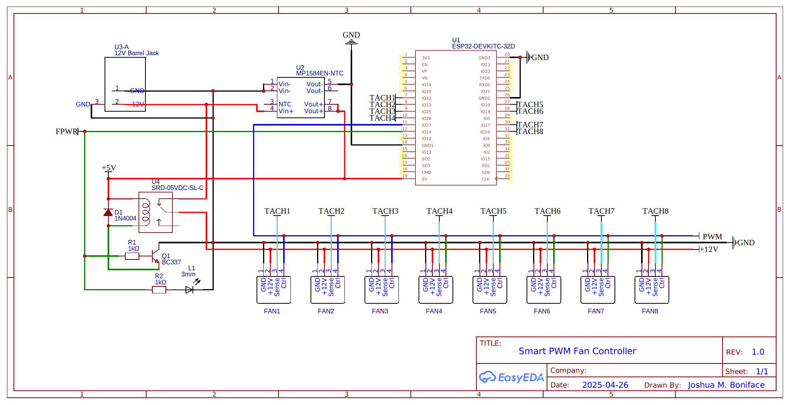
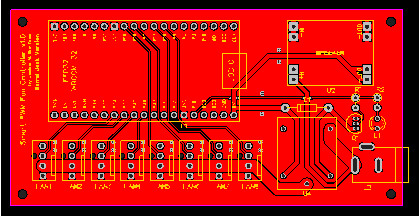

# Smart PWM Fan Controller v1.x Board Designs

This is a collection of [EasyEDA](https://easyeda.com/) schematics and board desgins for the Smart PWM Fan Controller v1.x's components.

You can import the design definition files (`*.easyeda.json`) directly into EasyEDA via "File" -> "Open" -> "EasyEDA". The schematic is provided for reference in both EasyEDA and SVG formats; if you just wish to manufacture the boards, you only need to import the board definitions, then via "Fabrication" -> "One-click Order PCB/SMT" complete the order at [JLCPCB](https://jlcpcb.com). We order all boards in a black silkscreen with all other options as default.

You can also see the designs directly on [OSHWLab here](https://oshwlab.com/joshuaboniface/smart-pwm-fan-controller-1-0).

The board design and images in this folder are © 2025 [Joshua M. Boniface](https://www.boniface.me) and licensed under the [Creative Commons Attribution-ShareAlike (BY-SA) 4.0](LICENSE) license.

## Schematic

The schematic is visible here in SVG format, and also as an EasyEDA definition in [schematic.easyeda.json](schematic.easyeda.json).

The individual parts can be found, with their labels (`R1`, etc.) in the [main README parts list](https://github.com/joshuaboniface/smart-pwm-fan-controller/?tab=readme-ov-file#parts-list).

## Board

This is the main board of the controller which contains all components.

The board is single-sided; there are no components on the reverse side, though most components are through-hole.

## Assembly

**NOTE:** The assembly step ordering is **extremely important** if you are using a **variable 12VDC-to-5VDC converter**! You must calibrate it before attaching most components, or can risk frying them.

Assembly is fairly straightforward aside from the ordering. Most of the soldering should be done with a standard soldering iron, though hot air or a hotplate can make attaching the MP1584EN easier.

1. Clean all PCBs thoroughly with isopropyl alcohol and paper towel.

2. If using hot air or a hotplate for the MP1584EN, apply a liberal amount of solder paste to each pad.

3. Solder the MP1584EN onto the board using the desired method.

4. Solder the barrel jack (or Molex connector) onto the board.

5. Perform calibration of the MP1584EN. Plug in a 12VDC source, and turn the adjustment screw until a multimeter on the output ports reads ~5.05VDC.

6. Solder the remaining components onto the board. We tend to start with the smaller components (Q1, L1, R1/R2, D1) then move onto the larger components (U4, U1, FANX).

5. Perform electrical continuity tests to ensure there are no stray bridges or faulty connections.

The Smart PWM Fan Controller is now fully assembled and ready for final testing/provisioning.
